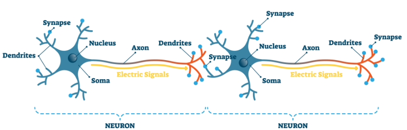

# The Human Brain

## Overview
- The brain, along with the spinal cord, constitutes the `Central Nervous System`.
- It is responsible for thoughts, interpretation and origin of control for body movements.
- On average, an adult brain weighs between 1.0 kg – 1.5 kg.
- It is mainly composed of neurons – the fundamental unit of the brain and nervous system.
- The brain is enclosed within the skull and is surrounded by the `Cerebrospinal Fluid (CSF)`. 
  - This fluid circulates within the skull and spinal cord, filling up hollow spaces on the surface of the brain.
  - It is used to neglect its weight.
  - The primary function of the CSF is to act as a buffer for the brain, cushioning mechanical shocks and dampening minor jolts.
  - It also provides basic immunological protection to the brain.

## Neurons
- Neurons are the fundamental building blocks of brain, constantly communicating with each other to process information, generate thoughts, and control actions.
- These neurons don't directly connect; instead, they communicate through `electrical signals` and `chemical messengers`.
- When a neuron is stimulated, it generates an electrical impulse that travels down its long, thin fiber called an `axon`.
- At the end of the axon, the electrical signal reaches tiny junctions called `synapses`.
- Here, the electrical signal can trigger the release of chemical messengers called `neurotransmitters`.
- These neurotransmitters then hop across the gap to another neuron's `dendrites` and influence its activity.
- When a large group of neurons in a specific brain region fire (send electrical impulses) in a synchronized manner, the combined electrical activity becomes strong enough to be detected by EEG or ECoG.
- The frequency (cycles per second) of these synchronized electrical discharges determines the type of `brainwave` we observe. 

    

## Brain Wave Chart
- A brainwave chart is a visual representation of the brain's electrical activity at different frequencies. It helps us understand the dominant brainwaves and the associated mental state.
- Breakdown
  - **Frequency (Hz):** Number of cycles per second of the brain wave activity.
  - **Brainwave Types:**
    - **Delta (0.5-4 Hz):** These are the slowest waves, dominant during deep sleep and unconsciousness.
    - **Theta (4-7.5 Hz):** Theta waves are associated with drowsiness, daydreaming, and light sleep.
    - **Alpha (8-12 Hz):** Alpha waves become prominent during relaxation, meditation, and states of calmness with your eyes closed.
    - **Beta (13-30 Hz):** These are faster waves linked to focused attention, problem-solving, and active thinking.
    - **Gamma (Above 30 Hz):** Gamma waves are the fastest and are associated with high cognitive functions, learning, and information processing.

        